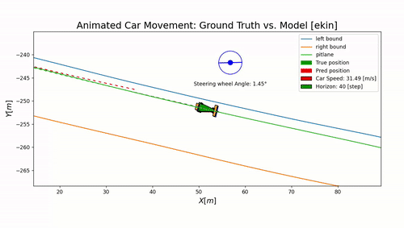

# vehicle-model-viz
A lightweight Python toolkit for validating vehicle dynamics models through animated visualizations. 
=======
# Dynaviz 🚗📈
*A vehicle dynamics model validation & visualization tool*

This repository provides visualization tools to validate vehicle dynamics models using **matplotlib animation**.  
It helps compare simulated vehicle states against ground truth data with dynamic, interactive plots.

---

## Features
- Animated visualization of vehicle trajectories on track
- Side-by-side comparison of ground truth vs. model predictions
- Support for multiple states (position, velocity, yaw, etc.)
- Easy to extend for new models and datasets

---

## Example Output


---

## Installation
```bash
# Clone this repository
git clone git@github.com:JyNing04/vehicle-model-viz.git
cd vehicle-model-viz

# (Optional) Install dependencies
pip install -r requirements.txt

# Run the validation script
python3 dynamic_validation.py
>>>>>>> 37abfe0 (initial commit)
